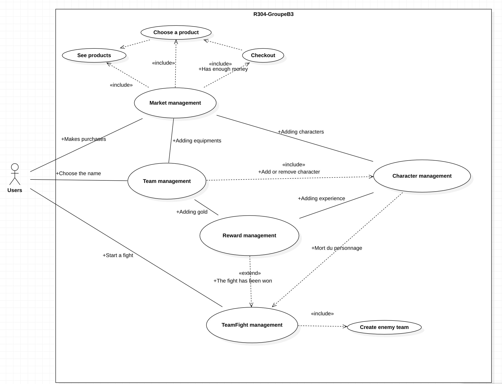

# R304 | Groupe B3
[](https://forthebadge.com)


# Sommaire

- [Sujet](#sujet)
- [Étude de conception](#étude-de-conception)
- [BackLog Produit](#backlog-produit)
  - [Description](#description)
  - [Technical Stories](#technical-stories)
  - [User Stories](#user-stories)
- [Présentation de l'application](#présentation-de-lapplication)
- [Synthèse](#synthèse)
- [Bilan technique](#bilan-technique)
- [Problèmes rencontrés](#problèmes-rencontrés)
- [Inventivité](#inventivité)
- [Généricité](#généricité)
- [Tests unitaires](#tests-unitaires)
- [Mesures d'amélioration](#mesures-damélioration)
- [Lancement de l'application](#lancement-de-lapplication)

## Sujet

Vous devez écrire la spécification fonctionnelle technique et coder l’implémentation d’une
application en Java et ses tests, qui doit utiliser les concepts vus lors de cet enseignement.

Le sujet porte sur les réalisations des TD TD3 : Java, cas pratique et TD4 :
Algorithmique « avancée ».

La partie « graphique » de votre application peut être minimaliste (affichage en ligne de commande
par exemple).

Vous devez utiliser le plus possible d’algorithmique, de structures de données, de particularités
du langage Java et de modèles de conception, notamment ceux vus dans cet enseignement. En
particulier, votre application doit comporter des classes abstraites, des interfaces, des collections,
avec des itérateurs, des exceptions, des threads, de la généricité, et au moins un algorithme de tri.

Vous devez apporter un soin tout particulier à la présentation du code source (indentation, respect
d’une convention de nommage, commentaires, etc.) et à l’architecture des répertoires.
Votre application doit être évolutive, modulaire et professionnelle (robuste, fiable et intégralement
fonctionnelle).

# Étude de conception

## BackLog Produit
### Description
- **Priorité** : 1 à 10 | 1 -> priorité faible ; 10 -> priorité extrême
- *Valeur métier* : Planning Poker

### Technical Stories

En tant que client, je souhaite que le projet utilise des modèles de conception. 

---
En tant que client, je souhaite que le projet utilise des classes abstraites. 

---
En tant que client, je souhaite que le projet utilise des interfaces. 

---
En tant que client, je souhaite que le projet utilise des collections. 

---
En tant que client, je souhaite que le projet utilise des itérateurs.

---
En tant que client, je souhaite que le projet utilise des exceptions.

---
En tant que client, je souhaite que le projet utilise des threads. 

---
En tant que client, je souhaite que le projet utilise de la généricité.

---
En tant que client, je souhaite que le projet utilise au moins un algorithme de tri.


---------
### User Stories

En tant qu'utilisateur, je souhaite que le soit sous forme de petite partie afin de pouvoir jouer durant mes pauses.
**Priorité** : 4
*Valeur métier* : 1

---
En tant qu'utilisateur, je souhaite choisir un personnage de départ afin de pouvoir commencer la partie.
**Priorité** : 6
*Valeur métier* : 1

-----
En tant qu'utilisateur, je souhaite pouvoir créer une équipe de personnage afin d'accumuler plusieurs personnages.
**Priorité** : 5
*Valeur métier* : 3

---
En tant qu'utilisateur, je souhaite choisir le nom de mon équipe afin d'être davantage en immersion.
**Priorité** : 1
*Valeur métier* : 1

-----
En tant qu'utilisateur, je souhaite pouvoir acheter des personnages au cours de la partie afin d'agrandir mon équipe.
**Priorité** : 3
*Valeur métier* : 3

---
En tant qu'utilisateur, je souhaite pouvoir acheter des équipements pour mes personnages au cours de la partie afin de renforcer mes personnages (augmentation des statistiques des personnages).
**Priorité** : 3
*Valeur métier* : 5

---
En tant qu'utilisateur, je souhaite que le jeu soit centré sur le combat entre mon équipe et une équipe adverse afin de pouvoir utiliser mes personnages.
**Priorité** : 10
*Valeur métier* : 8

---
En tant qu'utilisateur, je souhaite obtenir une récompense après avoir gagner un combat afin pouvoir améliorer mon équipe
**Priorité** : 3
*Valeur métier* : 2

---
En tant qu'utilisateur, je souhaite que la récompense contienne de l'or (monnaie du jeu) afin que je puisse acheter d'autres personnages et des équipements.
**Priorité** : 4
*Valeur métier* : 3

---
En tant qu'utilisateur, je souhaite qu'il y ait différents types de récompenses afin que le jeu ne soit pas monotone.
**Priorité** : 1
*Valeur métier* : 1

---
En tant qu'utilisateur, je souhaite que mes personnages aient un niveau afin qu'ils puissent augmenter leur puissance.
**Priorité** : 2
*Valeur métier* : 2

---
En tant qu'utilisateur, je souhaite que mes personnages obtiennent de l'expérience permettant de leur faire augmenter de niveau lorsque je gagne un combat (dans la récompense) afin d'augmenter leur puissance.
**Priorité** : 3
*Valeur métier* : 2

---
En tant qu'utilisateur, je souhaite que chaque personnage est une attaque spéciale afin de créer mon équipe stratégiquement et que le jeu soit davantage dynamique.
**Priorité** : 2
*Valeur métier* : 5

---
En tant qu'utilisateur, je souhaite que mes personnages puissent effectuer des coups critiques lorsqu'ils attaquent un ennemi afin que le jeu soit davantage dynamique.
**Priorité** : 2
*Valeur métier* : 2

---
En tant qu'utilisateur, je souhaite que mes personnages puissent effectuer des attaques basiques lorsqu'ils attaquent un ennemi afin que le jeu soit davantage dynamique.
**Priorité** : 6
*Valeur métier* : 1

---
En tant qu'utilisateur, je souhaite que lorsque je perd un combat, la partie se finisse afin que les parties soient courtes et que je puisse construire une autre stratégie.
**Priorité** : 4
*Valeur métier* : 1

---
En tant qu'utilisateur, je souhaite que chaque personnage possède des attributs spéciaux comme voler ou tirer à distance afin de pouvoir les différencier.
**Priorité** : 1
*Valeur métier* : 3

---
En tant qu'utilisateur, je souhaite pouvoir quitter le jeu lorsque j'en ai envie.
**Priorité** : 1
*Valeur métier* : 1

## Présentation de l'application

Notre applcation est un jeu où l'utilisateur créer sa propre équipe de personnages parmi :
    - Mage
    - Archer
    - Healer

L'utilisateur peut combattre une équipe adverse généré automatiquement par rapport à l'équipe de l'utilisateur.
Lors d'un combat, l'utilisateur peut perdre un ou plusieurs de ses personnages, mais lorsque l'utilisateur gagne, chaque personnage de son équipe gagne de l'expérience et de l'argent (gold).
Avec cet argent, il peut acheter d'autres personnages et des équipements augmenteront les statistiques de ses personnages.

Pour finir, lorsque l'utilisateur a perdu un combat, la partie est finie puisqu'il ne possède plus aucun personnage.



# Synthèse

Ce projet nous a permis de mettre en place la méthode SCRUM, cependant, étant donné la durée du projet, nous n'avons pas pu mettre en place, nous n'avons pu faire qu'un seul sprint.

Mais pour en revenir au projet, ce-dernier nous a permis de mettre en pratique nos connaissances acquises.

Grâce aux méthodes et aux outils fournis, nous avons pu identifier et résoudre plusieurs problèmes et optimiser le résultat final.

Les résultats obtenus nous ont permis de conclure que le projet a atteint son objectif et que les solutions proposées sont efficaces.

# Bilan technique

Nous avons mis en place un système de suivi en utilisant le Backlog Produit effectué aux prémices du projet pour vérifier la qualité de notre travail et veiller à ce que tous les objectifs soient atteints.
Grâce à cela, les délais ont été respectés et les objectifs initiaux ont été atteints.

Le projet a été livré dans un état stable et fonctionnel où nous avons veillés à la compréhension du code (indentation, respect d’une convention de nommage, commentaires, ...) et de l'architecture des répertoires.

Nous avons également effectué des tests et veillés à leur validation pour témoigner de la qualité du produit et du respect des besoins des utilisateurs.

Enfin, nous tenons à souligner que ce projet a été possible grâce à la participation et à l’engagement de tous les membres de l’équipe.

# Problèmes rencontrés
## Inventivité

L'une des choses qui a été la plus compliqué lors de ce projet a été de trouver des fonctionnalités tous au long du projet permettant d'implémenter tous ce qui a été demandé par le client (modèles de conception, Thread, algorithme de tri, généricité, ...).
Nous avons tout de même réussi à implémenter tous cela dans les temps.

## Généricité

L'un des premier problème rencontré lors du développement de l'application a été de mettre en place une généricité. En effet, nous n'avons pas encore l'habitude d'effectuer de la généricité mais cela nous a permis de mettre en pratique nos connaissances  théoriques sur le sujet.

## Tests unitaires

Après la fin du développement du jeu, nous avons demandé à notre professeur de vérifier la qualité de notre code et de nos tests. Et ce-dernier nous a spécifié que nous avons oublié d'effectuer des tests sur les fonctions utilisant une valeur aléatoire.

# Mesures d'amélioration

L'un des problèmes lors du développement de l'application a été de ne pas avoir fait tester celle-ci a des utilisateurs pour récupérer leurs avis et leurs conseils.

## Lancement de l'application

Pour commencer, télécharger l'application en exécutant la commande :
```bash
git clone https://github.com/LennyGonzales/R304-GroupeB3.git
```

Puis à partir d'un IDE, exécuter simplement cette ligne du fichier Main.java
```java
    public static void main(String[] args) throws InterruptedException, EmptyNameForCharactersTeamException {
```

## Membres

- GANASSI Alexandre
- GONZALES Lenny
- SAUVA Mathieu
